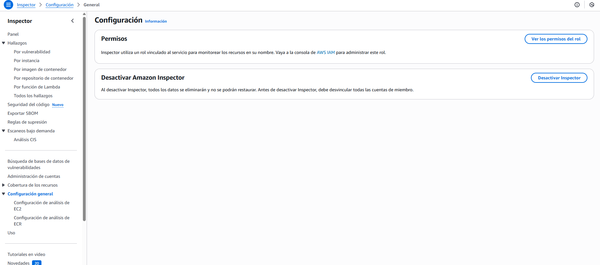
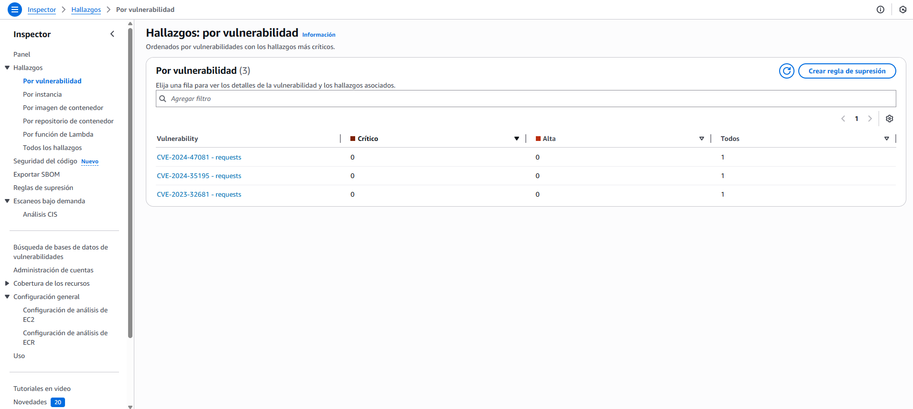
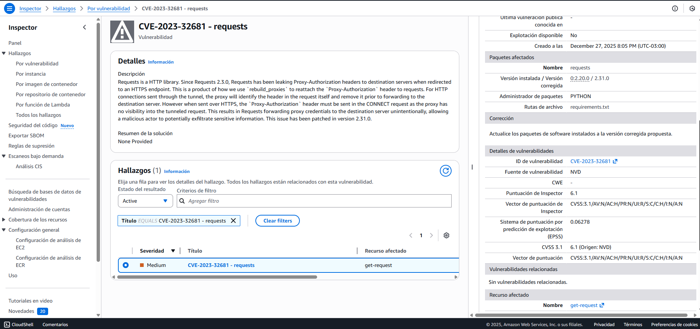
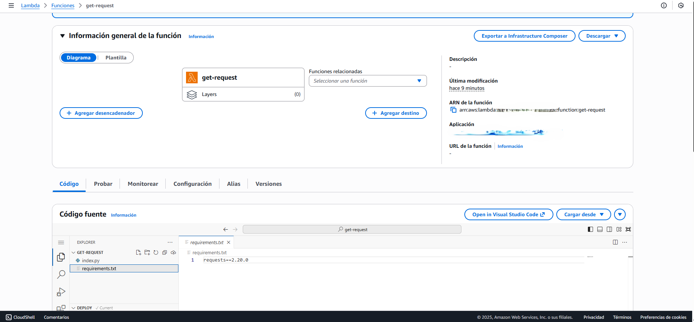
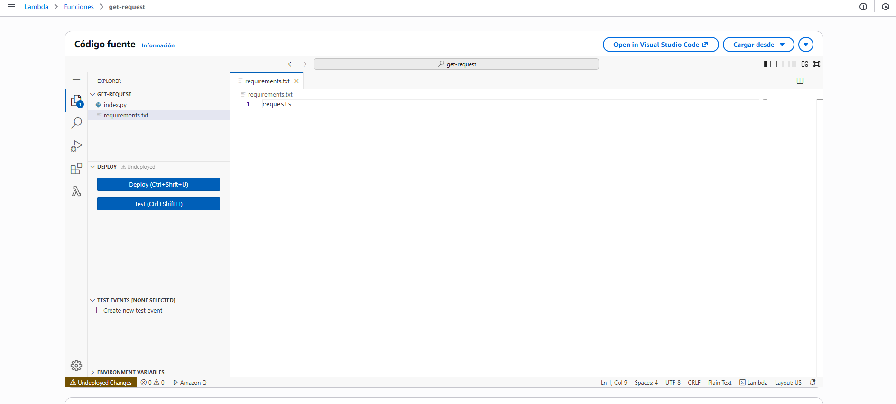
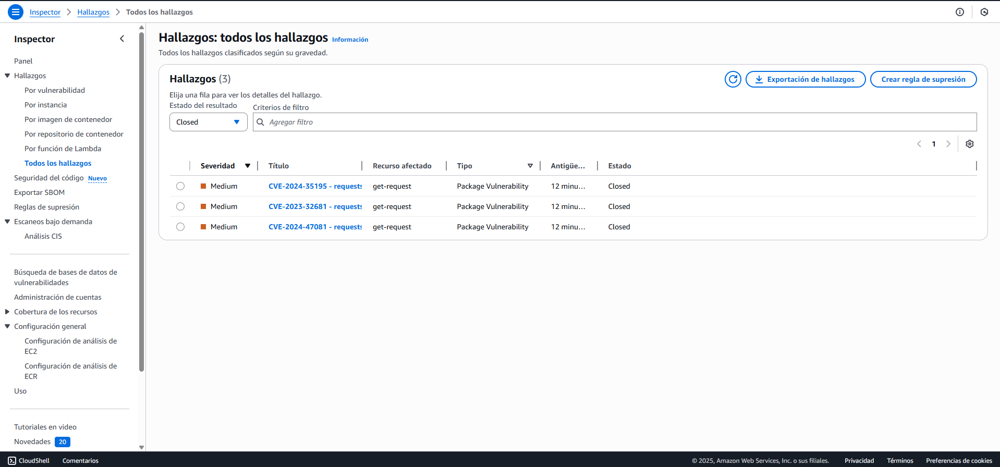
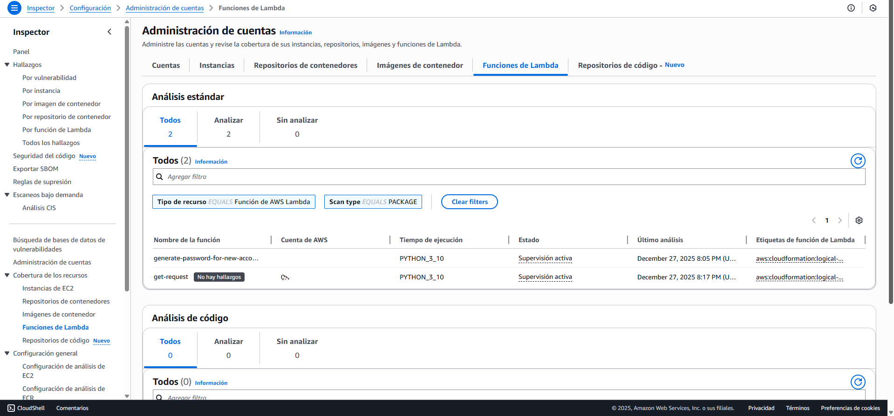

# Gestión de Vulnerabilidades en AWS Lambda con Amazon Inspector

## 1. Introducción

En este laboratorio se implementa un flujo de trabajo de seguridad automatizada
para una arquitectura serverless en AWS.  
El objetivo principal es identificar, analizar y remediar vulnerabilidades en las
dependencias de funciones AWS Lambda mediante el uso de Amazon Inspector.

Esta solución permite a los equipos de desarrollo adoptar un enfoque **DevSecOps**,
integrando la seguridad de forma continua en el ciclo de vida del software, sin
necesidad de realizar escaneos manuales y asegurando que el código en producción
esté libre de **CVEs (Common Vulnerabilities and Exposures)** conocidos.

---

## 2. Tecnologías Utilizadas

- **Amazon Inspector**  
  Servicio de gestión de vulnerabilidades que analiza de forma continua funciones
  AWS Lambda.

- **AWS Lambda**  
  Servicio de computación serverless para la ejecución de funciones.

- **Python (requests)**  
  Lenguaje y biblioteca utilizada en la función Lambda donde se detectó la
  vulnerabilidad.

---

## 3. Desarrollo del Laboratorio

### Fase 1: Activación y Cobertura

Se activó Amazon Inspector para realizar un escaneo continuo del entorno.  
El servicio detectó automáticamente los recursos compatibles y comenzó el análisis
de seguridad sin requerir la instalación de agentes.

**Evidencia:**  
Panel de Amazon Inspector mostrando el servicio habilitado y configurado para el
análisis continuo de funciones AWS Lambda.


---

### Fase 2: Análisis de Vulnerabilidades (Detección)

Tras el escaneo inicial, Amazon Inspector identificó vulnerabilidades en una función
Lambda llamada `get-request`.

Entre los hallazgos se detectó la **CVE-2023-32681**, asociada a la biblioteca
`requests`.

**Detalle del hallazgo:**
- Severidad: Media  
- Origen: Uso de una versión desactualizada del paquete en `requirements.txt`

**Evidencia:**  
Listado de hallazgos de Amazon Inspector con estado **Active** tras el escaneo inicial.


**Evidencia:**  
Vista de hallazgos agrupados por vulnerabilidad en Amazon Inspector.


---

### Fase 3: Estrategia de Remediación

Amazon Inspector proporciona recomendaciones claras para mitigar cada
vulnerabilidad detectada.

En este caso, se recomendó actualizar la biblioteca `requests` a una versión
superior a **2.31.0**, reduciendo riesgos asociados a la seguridad de red.

**Evidencia:**  
Detalle del hallazgo **CVE-2023-32681**, incluyendo descripción y severidad.


---

### Fase 4: Aplicación del Parche de Seguridad

Se actualizaron las dependencias de la función Lambda modificando el archivo
`requirements.txt`, eliminando la restricción de versión estricta:

```txt
requests==2.20.0

```

y permitiendo el uso de una versión más reciente y segura durante el despliegue.

Posteriormente, la función fue redeplegada en AWS Lambda.

**Evidencia:**  
Información general de la función AWS Lambda `get-request`.



Actualización del código fuente y dependencias de la función Lambda.



Una vez aplicada la actualización, Amazon Inspector re-evaluó automáticamente la
función Lambda.

El estado del hallazgo cambió de Active a Closed, confirmando que la
vulnerabilidad fue mitigada correctamente.

**Evidencia:**  
Panel de Amazon Inspector mostrando todos los hallazgos con estado **Closed**
tras la aplicación del parche de seguridad.

.

**Evidencia adicional:**  
Vista de administración de cuentas donde la función `get-request` no presenta
hallazgos de seguridad.



---

## 5. Conclusiones y Aprendizajes

**Automatización de la seguridad**

Amazon Inspector elimina la necesidad de auditorías manuales, detectando
vulnerabilidades de forma continua tras cada despliegue.

**Priorización efectiva de riesgos**

La clasificación por severidad permite enfocarse en las vulnerabilidades con
mayor impacto en producción.

**Enfoque DevSecOps**

Integrar herramientas de seguridad en la nube facilita que la protección de las
aplicaciones sea una responsabilidad compartida entre desarrollo y operaciones.


