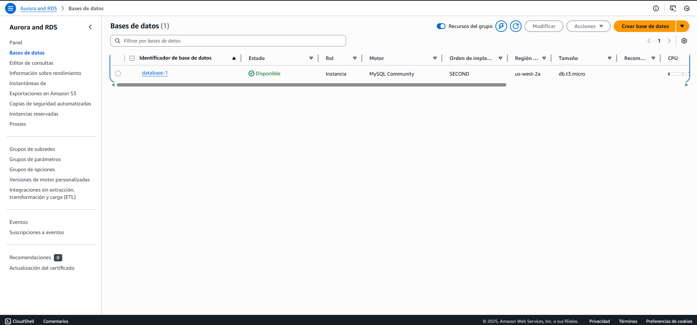
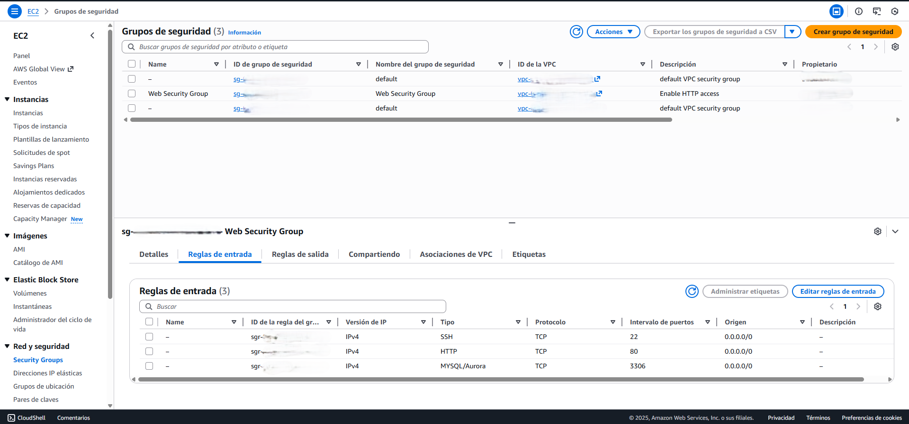
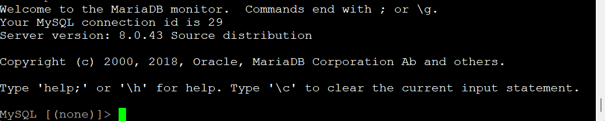
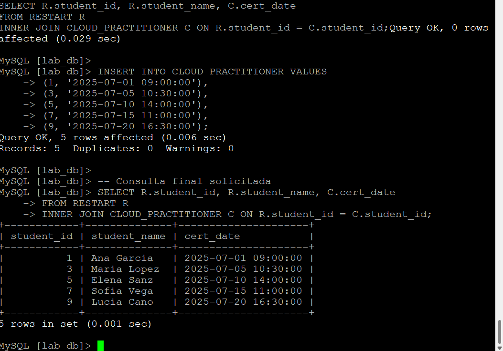

# Despliegue e Interacción con Amazon RDS (MySQL)

**Autora:** Patricia Constanza Salas González

## 1. Descripción del Proyecto

Este proyecto consistió en el aprovisionamiento de una base de datos administrada mediante Amazon RDS (MySQL) y la interacción técnica a través de una instancia de cómputo Amazon EC2 (Linux). El objetivo principal fue demostrar la capacidad de configurar redes seguras, gestionar almacenamiento en la nube y ejecutar consultas SQL para el manejo de datos relacionales.

## 2. Arquitectura del Laboratorio

El entorno en la nube se compuso de los siguientes elementos técnicos:

* Base de Datos: Amazon RDS con motor MySQL.
* Instancia de Cómputo: Servidor Linux (EC2) actuando como cliente de conexión.
* Red: Amazon VPC con Grupos de Seguridad configurados específicamente para permitir tráfico entrante en el puerto 3306.

---

## 3. Fases de Implementación

**Fase 1: Creación de la Instancia RDS**

Se configuró una instancia de base de datos MySQL bajo el esquema de capa gratuita con las siguientes especificaciones:
* Clase de instancia: db.t2.micro / db.t3.micro.
* Almacenamiento: 20GB - 100GB SSD (gp2).
* Red: Desplegada en una VPC específica (Lab VPC) con conectividad habilitada para el servidor de aplicaciones.


####  Aprovisionamiento en AWS Se observa la base de datos MySQL desplegada correctamente. Se utilizó una arquitectura de Amazon RDS para garantizar la alta disponibilidad y administración simplificada.



**Fase 2: Conexión y Configuración del Cliente**

Se accedió al servidor Linux mediante SSH para instalar las herramientas necesarias:

```Bash
# Instalación del cliente MariaDB en Amazon Linux 2
sudo amazon-linux-extras install mariadb10.5
```

La conexión al endpoint de RDS se realizó mediante el comando: mysql -h <endpoint-rds> -P 3306 -u <usuario> -p

#### Configuración de Red (Capa de Seguridad) Implementación de reglas de firewall mediante Security Groups. Se restringió el acceso solo a los puertos necesarios (3306 para la BD y 22 para administración remota). 




**Fase 3: Manipulación de Datos (SQL)**

Se diseñó un esquema de base de datos relacional compuesto por dos tablas vinculadas:
1. Tabla RESTART: Almacena información de estudiantes (ID, nombre, ciudad y fecha de graduación).
2. Tabla CLOUD_PRACTITIONER: Registra las fechas de certificación, utilizando el student_id como Llave Foránea (Foreign Key) para mantener la integridad referencial con la tabla anterior.

#### Validación de Conectividad Prueba de "handshake" exitosa entre la instancia EC2 y el motor RDS. Esta captura confirma que la configuración de la VPC y los permisos de usuario son correctos. 



**Fase 4: Operaciones Avanzadas (Inner Join)**

Para obtener una vista consolidada de los estudiantes que completaron su certificación, se ejecutó una consulta de unión:

```SQL
SELECT R.student_id, R.student_name, C.cert_date
FROM RESTART R
INNER JOIN CLOUD_PRACTITIONER C ON R.student_id = C.student_id;
```

#### Consulta de Datos Compleja Resultado de la operación `INNER JOIN`. Aquí se demuestra la capacidad de extraer información relacionada entre tablas de estudiantes y certificaciones. 



---

## 4. Conclusiones

* Escalabilidad: Se logró la provisión de infraestructura de base de datos escalable en AWS.
* Seguridad: Se configuró correctamente el acceso de red entre servicios (EC2 a RDS) mediante políticas de menor privilegio.
* Integridad: Se validó el diseño de la base de datos mediante el uso de llaves primarias y relaciones lógicas.
