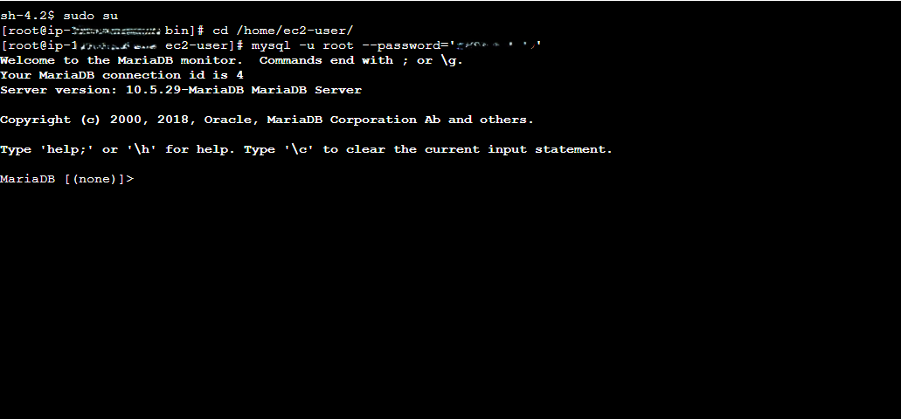
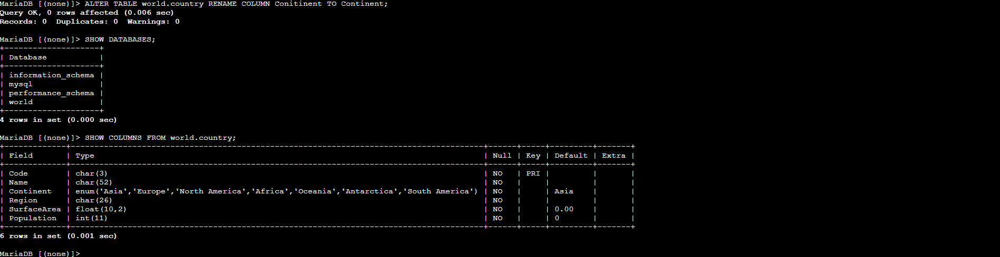
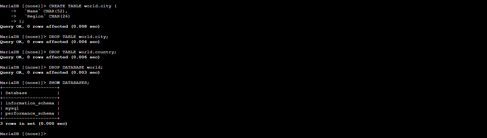

# Gestión de Bases de Datos Relacionales con MySQL en AWS EC2

**Autor:** Patricia Constanza Salas González

Este proyecto documenta la configuración y manipulación de una base de datos relacional utilizando MySQL sobre una instancia Amazon EC2. El objetivo es demostrar el dominio del lenguaje SQL para la creación, modificación y eliminación de estructuras de datos.
---
## 🛠 Herramientas Utilizadas
-	**Infraestructura:** AWS (Amazon Web Services).
-	**Servicios:** Amazon EC2 (Command Host), Systems Manager (Session Manager).
-	**Base de Datos:** MySQL Server.
-	**Lenguaje:** SQL (Structured Query Language).
---
## Tarea 1: Conexión al Host de Comandos

El primer paso consistió en conectarse a la instancia de EC2 configurada como cliente de base de datos para interactuar con el motor MySQL.


**1. Acceso a la terminal mediante Session Manager**.

**2. Elevación de privilegios y acceso al directorio del usuario:**

```bash
sudo su
cd /home/ec2-user/
```
**3. Conexión al cliente MySQL:**

```bash
mysql -u root --password='[PASSWORD_CENSURADO]' 
```

 
--

## Tarea 2: Creación de Estructuras (Databases & Tables)

En esta fase, se creó el contenedor de datos y se definió el esquema de la tabla principal.

**1. Gestión de Bases de Datos**

Visualización de bases existentes y creación de la nueva base de datos world:

```SQL
SHOW DATABASES;

CREATE DATABASE world;
```

**2. Creación de la Tabla country**

Se definió un esquema detallado incluyendo tipos de datos como CHAR, ENUM, FLOAT e INT, además de establecer la clave primaria (PRIMARY KEY).

```SQL

CREATE TABLE world.country (
  `Code` CHAR(3) NOT NULL DEFAULT '',
  `Name` CHAR(52) NOT NULL DEFAULT '',
  `Conitinent` enum('Asia','Europe','North America','Africa','Oceania','Antarctica','South America') NOT NULL DEFAULT 'Asia',
  `Region` CHAR(26) NOT NULL DEFAULT '',
  `SurfaceArea` FLOAT(10,2) NOT NULL DEFAULT '0.00',
  `Population` INT(11) NOT NULL DEFAULT '0',
  PRIMARY KEY (`Code`)
);
```

```SQL
SHOW TABLES IN world;
```

Resultado de SHOW TABLES;

 
---

## 3. Alteración de Estructura (DML)

Se identificó un error tipográfico en la columna Conitinent. Se procedió a corregirlo mediante el comando ALTER:

```SQL
ALTER TABLE world.country RENAME COLUMN Conitinent TO Continent;
```


 
---

## 💡 Desafío 1: Creación de Tabla Adicional

Como parte del reto práctico, se creó la tabla city con columnas específicas para demostrar versatilidad en la definición de tablas, esto permite futura relación con country mediante joins
:

```SQL
CREATE TABLE world.city (
  `Name` CHAR(52), 
  `Region` CHAR(26)
);
```
---

## Tarea 3: Limpieza y Eliminación (DROP)

Finalmente, se practicó la eliminación segura de los recursos creados para mantener la integridad y orden del servidor.

**1. Eliminar tablas:**

```SQL
DROP TABLE world.city;
DROP TABLE world.country;
```

**2. Eliminar base de datos:**

```SQL
DROP DATABASE world;
```

**3. Verificación Final:**

```SQL
SHOW DATABASES;
```


 
---

## Conclusiones

A través de este laboratorio, se validaron las siguientes competencias técnicas:

**CREATE:** Definición de bases de datos y esquemas de tablas complejos.

**SHOW:** Inspección y auditoría de recursos de datos.

**ALTER:** Mantenimiento y corrección de estructuras existentes sin pérdida de integridad.

**DROP:** Gestión del ciclo de vida de los datos y eliminación de recursos.

