# Gestión Segura de EC2 con IAM y AWS Systems Manager (SSM)

**Autora:** Patricia Constanza Salas

Este proyecto documenta la implementación de una infraestructura segura en AWS, diseñada bajo el principio de **mínimo privilegio** y enfocada en la gestión operativa de servidores sin exposición de puertos críticos.

## Objetivo
Configurar un entorno de soporte técnico que permita administrar instancias EC2 de forma segura, eliminando el uso de llaves SSH y el acceso por puerto 22, utilizando en su lugar **AWS Systems Manager (SSM)**.

---

##  Análisis de Políticas de Seguridad
Para este proyecto se aplicaron políticas específicas que garantizan un control granular del acceso:

1.  **AmazonEC2ReadOnlyAccess**: Permite visualizar el estado y configuración de las instancias, pero impide realizar cambios (crear, detener o borrar), ideal para tareas de diagnóstico.
2.  **CloudWatchReadOnlyAccess**: Habilita la lectura de métricas y estados de salud para monitorear el rendimiento de los recursos.
3.  **AmazonSSMReadOnlyAccess**: Permite al equipo de soporte ver los nodos gestionados por Systems Manager sin otorgar permisos de ejecución de comandos.
4.  **AmazonSSMManagedInstanceCore**: Esta es una política de servicio que permite a la instancia EC2 comunicarse con el backend de SSM, habilitando el acceso por terminal web de forma segura.

---

##  Guía de Implementación Paso a Paso

### Fase 1: Control de Identidades (IAM)
* **Creación de Usuario:** Se creó el usuario `it-support` con acceso limitado a la consola.
* **Seguridad:** Se activó el **MFA (Multi-Factor Authentication)** para proteger la cuenta contra accesos no autorizados.

> **Capturas Relacionadas:**
> - 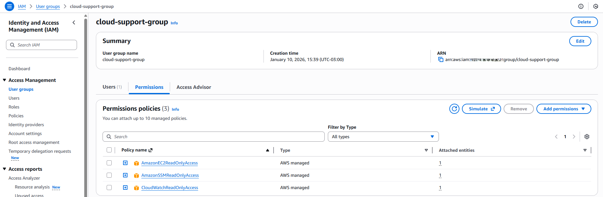 *(Muestra el usuario y políticas)*
> - 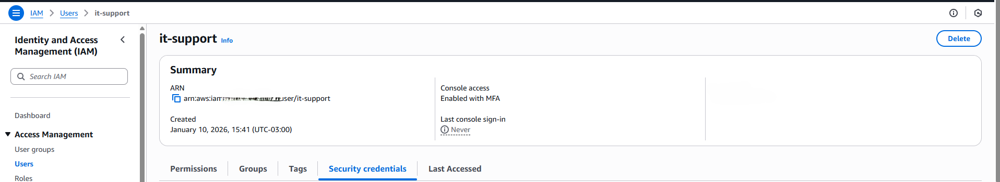 *(Confirmación de seguridad MFA)*

### Fase 2: Red y Aislamiento (VPC)
* Se configuró una VPC dedicada con una subred pública y un **Internet Gateway** para permitir que el agente de SSM de la instancia se comunique con los endpoints de AWS.
* Se configuraron las tablas de rutas para dirigir el tráfico hacia el gateway.

> **Capturas Relacionadas:**
> - 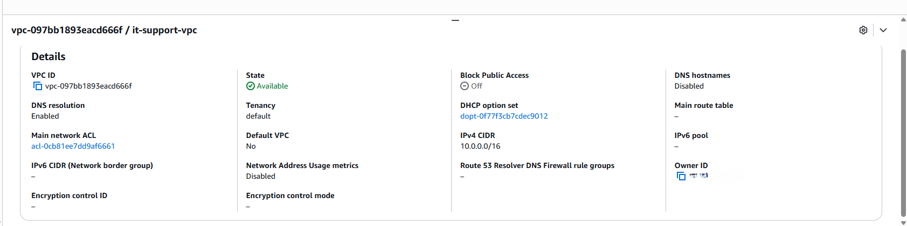
> - 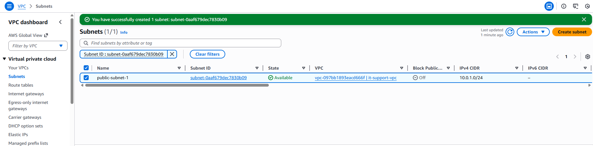
> - 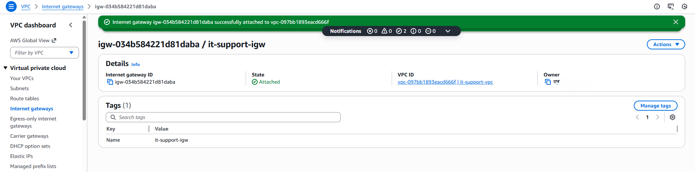
> - 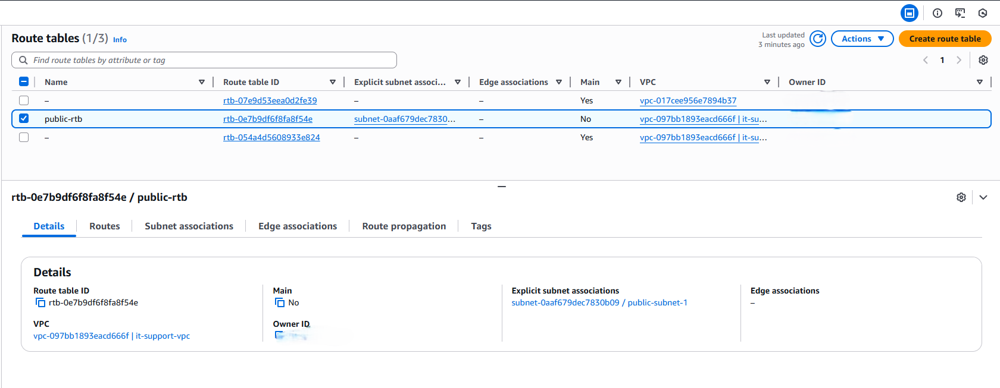

### Fase 3: Rol de Instancia y Despliegue de EC2
* Se creó un **Rol IAM** (`it-support-ssm-role`) que permite a la EC2 actuar bajo la política de Systems Manager.
* Se lanzó una instancia **Amazon Linux 2023** sin pares de llaves (.pem), reforzando la seguridad.
* **Security Group:** Se configuró con **Inbound Rules vacías**, lo que significa que nadie puede entrar por puertos tradicionales (SSH/HTTP).

> **Capturas Relacionadas:**
> - 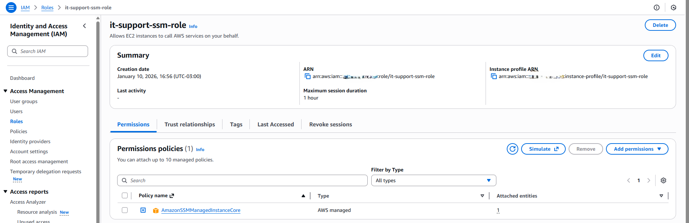
> - 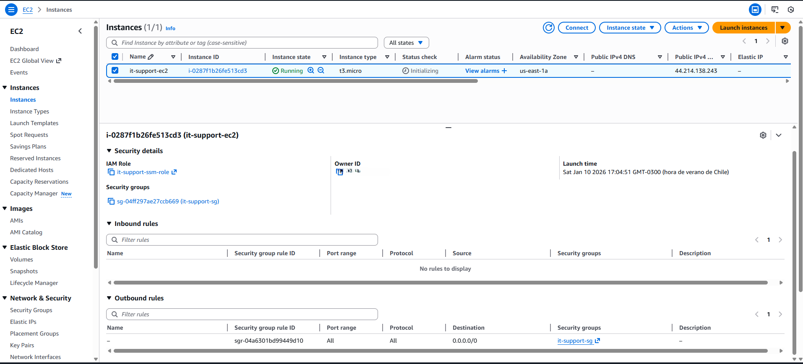
> - 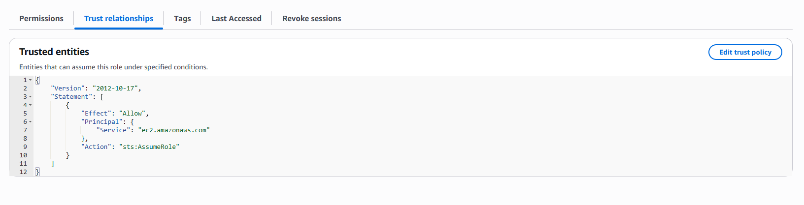
> - 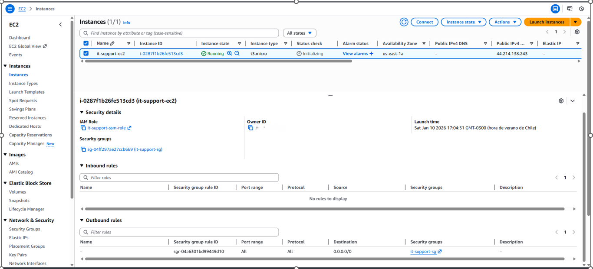

### Fase 4: Verificación de Acceso Seguro
En esta etapa final, se validó el acceso a la instancia. A diferencia de los métodos tradicionales, aquí no se utilizó un cliente SSH externo ni llaves privadas.

**¿Cómo funciona?:** Al intentar conectar, el **Agente de SSM** instalado en la instancia Amazon Linux se comunica con el servicio de AWS mediante el rol IAM asignado. AWS valida las credenciales del usuario y abre un túnel HTTPS seguro.

* **Usuario Temporal (ssm-user):** Al establecer la conexión, AWS Systems Manager crea automáticamente un usuario local temporal llamado ssm-user.
    -	Este usuario no tiene contraseña persistente.
    -	No requiere gestión de llaves .pem.
    -	Permite ejecutar comandos de administración con privilegios sudo de forma auditada.
* **Seguridad:** Al cerrar la sesión, el acceso se corta inmediatamente y no quedan "puertas traseras" (como puertos abiertos) que puedan ser explotadas.

> **Captura Relacionada:**
> - 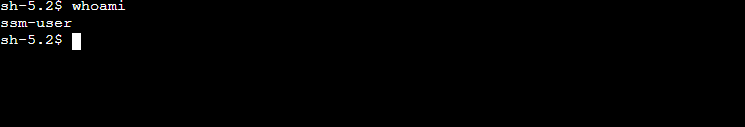 *(Prueba final con el comando `whoami` mostrando el acceso exitoso)*

---

## 🛠️ Tecnologías Utilizadas
* **Cloud:** AWS (VPC, EC2, IAM, SSM).
* **Seguridad:** MFA, Least Privilege Principle, Security Groups (Stateless).
* **SO:** Amazon Linux 2023.

---

##  Conclusiones
Este proyecto demuestra la capacidad de gestionar infraestructura en la nube bajo estándares modernos de seguridad, reduciendo la superficie de ataque y optimizando la administración de accesos para equipos de soporte técnico.
